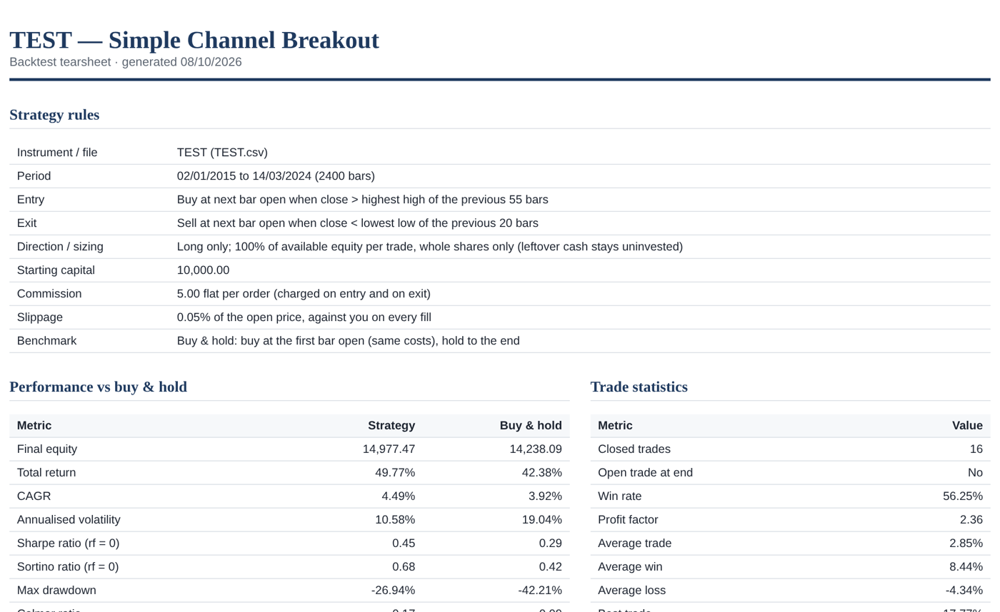
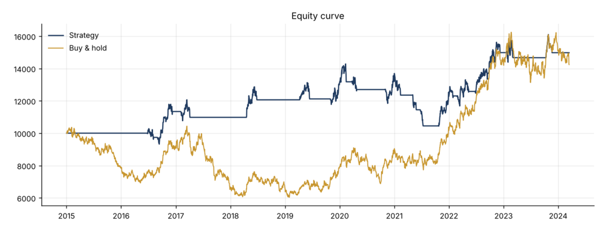

# Simple Channel Breakout Backtest

A [Claude](https://claude.ai) skill that backtests a **long-only channel breakout strategy** on a single stock or ETF. Point Claude at a CSV or Excel price file, answer a few questions, and get back a fund-style HTML tearsheet (with an optional PDF) that compares the strategy with buy & hold.

The skill runs the same fixed rules every time. All calculations are done by a bundled Python script, so the same input always gives the same output.



---

## What it does

1. Reads your price file (`.csv` or `.xlsx`).
2. Asks you for the strategy parameters. It never assumes any.
3. Runs the backtest with `scb_backtest.py`.
4. Produces:
   - an **HTML tearsheet** (always)
   - a **PDF tearsheet** (if you ask for one)
   - a **trade list CSV**

## The strategy

| | Rule |
|---|---|
| **Entry** | When the bar's close is **above** the highest **high** *or* highest **close** (your choice) of the previous **X** bars, buy at the **next bar's open**. |
| **Exit** | When the bar's close is **below** the lowest **low** *or* lowest **close** (your choice) of the previous **Y** bars, sell at the **next bar's open**. |
| **Direction** | Long only. |
| **Sizing** | 100% of available cash per trade, **whole shares only**. Leftover cash stays uninvested. |
| **Compounding** | Profits and losses from closed trades go back into the cash pool, and the next trade is sized from the new balance. |
| **Costs** | Flat commission per order, charged on entry and on exit (default 0). Slippage as a % of the fill price, always against you (default 0%). |
| **Benchmark** | Buy & hold on the same file: buy at the first bar's open with the same costs and hold to the end. |

**No look-ahead:** the channel only uses the *previous* X or Y bars. The signal bar is never included in its own channel, and every trade fills on the bar *after* the signal.

**No optimisation:** the skill has no parameter sweeps and no presets. You choose every parameter yourself.

## Input file requirements

The file **must** contain these five columns. Names are not case-sensitive, and extra columns are ignored:

| date | open | high | low | close |
|---|---|---|---|---|
| 02/01/2024 | 101.20 | 102.85 | 100.90 | 102.40 |
| 03/01/2024 | 102.35 | 103.10 | 101.75 | 101.95 |

- **Dates must be `dd/mm/yyyy`.** Excel date cells also work. Every date in the output is shown as dd/mm/yyyy.
- Prices should already be adjusted for splits and dividends.
- Use one security per file. If an Excel workbook has several sheets, Claude asks which one to use.

The run **stops with a clear message** (and does not guess) if:
- any of the five required columns is missing
- a date can't be read as dd/mm/yyyy
- a price is blank or not a number
- a date appears twice
- there are not enough bars for the chosen X or Y
- the starting capital can't buy even one share

## Parameters Claude will ask for

| # | Parameter | Options / format | Default |
|---|---|---|---|
| 1 | Entry basis | `high` or `close` | none, you choose |
| 2 | X (entry lookback) | whole number of bars | none, you choose |
| 3 | Exit basis | `low` or `close` | none, you choose |
| 4 | Y (exit lookback) | whole number of bars | none, you choose |
| 5 | Starting capital | amount | none, you choose |
| 6 | Commission | flat amount per order | 0 |
| 7 | Slippage | percent, e.g. `0.05` = 0.05% | 0% |
| 8 | Output | HTML, or HTML + PDF | HTML |

## What's in the tearsheet

- **Strategy rules**: exactly what you selected, so every report is self-documenting
- **Performance vs buy & hold**: final equity, total return, CAGR, annualised volatility, Sharpe, Sortino, max drawdown, Calmar ratio, longest drawdown
- **Trade statistics**: number of trades, win rate, profit factor, average trade / win / loss, best and worst trade, average bars held, exposure (time in market)
- **Charts**: equity curve vs buy & hold, drawdown, price with entry and exit channels and trade markers, monthly returns heatmap with yearly totals
- **Full trade list**: signal dates, fill dates and prices, shares, P&L and return per trade



*The sample images come from a test run on synthetic price data, not a real security.*

Sharpe and Sortino use a zero risk-free rate. They are annualised automatically from the data frequency (daily, weekly or monthly). If a position is still open at the end of the data, it is valued at the last close and marked "Open" in the trade list.

---

## Installation

### Claude Code

Copy the skill folder into your personal skills folder and install the Python libraries it uses.

**Mac / Linux**
```bash
git clone https://github.com/kbkb1111/Agent-Skills---Simple-Channel-Breakout.git
mkdir -p ~/.claude/skills
cp -r Agent-Skills---Simple-Channel-Breakout/simple-channel-breakout-backtest ~/.claude/skills/
pip install -r Agent-Skills---Simple-Channel-Breakout/requirements.txt
```

**Windows (PowerShell)**
```powershell
git clone https://github.com/kbkb1111/Agent-Skills---Simple-Channel-Breakout.git
mkdir $HOME\.claude\skills -Force
Copy-Item -Recurse Agent-Skills---Simple-Channel-Breakout\simple-channel-breakout-backtest $HOME\.claude\skills\
pip install -r Agent-Skills---Simple-Channel-Breakout\requirements.txt
```

To use the skill in a single project only, put the folder in that project's `.claude/skills/` instead.

### Claude.ai (web / desktop app)

1. Zip the `simple-channel-breakout-backtest` folder.
2. In Claude, open **Settings** and find **Skills** (usually under Capabilities), then upload the zip.
3. Make sure code execution is enabled, because the skill runs Python.

## Usage

Start a new conversation and either attach the price file (Claude.ai) or point to it (Claude Code):

> Use the simple channel breakout backtest skill on SPY.csv

Claude asks for the parameters, repeats your settings back to you, runs the backtest and gives you the tearsheet files with a short summary.

### Running the script directly

The script also works without Claude:

```bash
python simple-channel-breakout-backtest/scb_backtest.py \
  --file examples/sample_prices.csv \
  --entry-basis high --x 20 \
  --exit-basis low --y 10 \
  --capital 10000 --commission 5 --slippage 0.05 \
  --pdf --outdir out
```

| Flag | Meaning |
|---|---|
| `--file` | Path to the `.csv` or `.xlsx` price file |
| `--sheet` | Sheet name (only for workbooks with several sheets) |
| `--name` | Label for the report, e.g. the ticker (defaults to the file name) |
| `--entry-basis` | `high` or `close` |
| `--x` | Entry lookback in bars |
| `--exit-basis` | `low` or `close` |
| `--y` | Exit lookback in bars |
| `--capital` | Starting capital |
| `--commission` | Flat commission per order (default 0) |
| `--slippage` | Slippage in percent (default 0) |
| `--pdf` | Also produce a PDF |
| `--outdir` | Output folder (default: current folder) |

The script prints a JSON summary. If the input is invalid, it prints `"status": "error"` with a plain-English message.

## Repository structure

```
simple-channel-breakout-backtest/
  SKILL.md           # instructions Claude follows (includes a copy of the script)
  scb_backtest.py    # the backtest engine and tearsheet generator
examples/
  sample_prices.csv  # small synthetic price file for a quick test
docs/images/         # screenshots used in this README
requirements.txt     # pandas, numpy, matplotlib, openpyxl
```

## Requirements

- Python 3.9+
- `pandas`, `numpy`, `matplotlib`, `openpyxl`

## Limitations

- One security per run, long only, no leverage and no short selling.
- Fills at the next open assume you can trade at that price (plus your slippage). Gaps and liquidity are not modelled beyond that.
- No dividends or interest on uninvested cash.
- Old `.xls` files are not supported. Re-save them as `.xlsx` or `.csv`.

## Disclaimer

This tool is for research and education. Backtest results are hypothetical, depend on the quality of your data, and do not guarantee future performance. Nothing here is investment advice.
